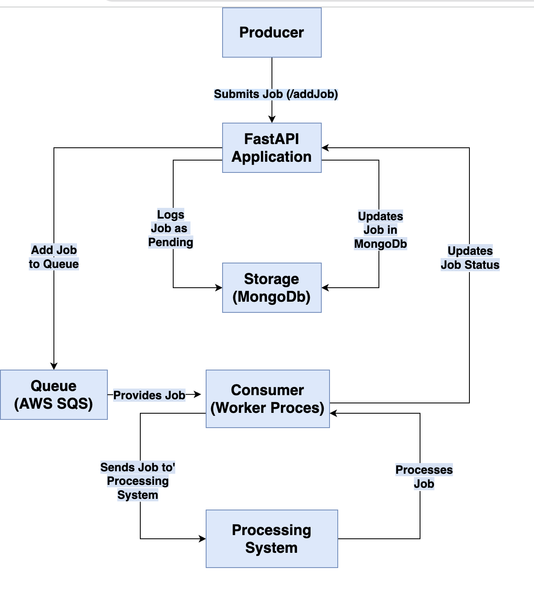

# [Job Queue Management System](http://3.111.240.160/docs)
## Overview
This project presents a robust Job Queue Management System, leveraging FastAPI, MongoDB, and AWS SQS. It is designed to efficiently manage and process asynchronous jobs, offering a resilient and scalable solution for handling various tasks. The system allows clients to queue jobs, which are then processed by a worker service. Each job's status is meticulously tracked, providing transparency and control over the job lifecycle.

# Key Features
### 1. Job Submission and Queueing

- **Endpoint**: `/addJob`
- **Functionality**: Clients can submit jobs, which are assigned a unique ID and added to the SQS queue.
- **Resilience**: In case of any failure during job submission, an appropriate error response is returned.

### 2. Job Status Tracking

- **Endpoint**: `/status`
- **Functionality**: Provides the status of queued or processed jobs, allowing filtering by job status and limiting the number of results.
- **Detailed Information**: Each job's status, number of attempts, and timestamp are retrievable.

### 3. Resilient Job Processing

- **Worker Process**: Processes each job by calling an external service and handling its response.
- **Retries on Failure**: Jobs that fail (HTTP 500 response) are retried up to 3 times (configurable).
- **Status Update**: Based on the processing response, jobs are marked as `SUCCESS`, `FAILED`, or `PENDING`.

### 4. Configurability

- **Customizable Parameters**: Key parameters like maximum retry attempts and processing delays are configurable through `config/application.yaml`.
- **External Service Configuration**: The system communicates with an external service, whose endpoint and other settings are configurable.

### 5. Logging and Performance Monitoring

- **API Logging**: All API calls are logged with their execution time, aiding in performance monitoring.
- **Error Handling**: Systematic logging of errors and exceptions provides insights for troubleshooting.

### 6. Secure and Scalable Infrastructure

- **AWS SQS Integration**: Utilizes AWS SQS for reliable and scalable job queuing.
- **MongoDB**: Leverages MongoDB for efficient data storage and retrieval.

### 7. Efficient Secrets Management

- **Secure Storage and Retrieval**: Utilizes AWS Secrets Manager and environment variables to securely store and retrieve sensitive information, avoiding hard-coded credentials.
- **CI/CD Security**: Implements GitHub Secrets to safely pass sensitive data during the CI/CD process, ensuring secure and automated deployment workflows.

## System Architecture

- **API Layer (FastAPI)**:
   - Hosts the endpoints for job submission and status retrieval.
   - Integrates middleware for logging and performance tracking.
- **Database (MongoDB)**:
   - Stores job details including status, timestamps, and attempt counts.
- **Message Queue (AWS SQS)**:
   - Queues jobs for processing, ensuring delivery and order.
- **Worker Process**:
   - Polls SQS for new jobs.
   - Processes jobs by interacting with an external service.
   - Updates job status based on the response.
- **Processing System**:
   - Provided by the autflow using an external api exposed at url ```https://ah9x9uxtyc.execute-api.ap-south-1.amazonaws.com/default/autoflow_full_stack_assignment```
- **Configuration Management**:
   - Configurations for the system are managed through YAML and Python files, ensuring easy adjustments for different environments.

### System Diagram


### Sequence Diagram


## API Documentation
### Endpoint: `/addJob`

- **Method**: POST
- **Functionality**: Adds a new job to the processing queue.
- **Response**:
```json
{
  "message": "Job added successfully",
  "jobId": "unique_job_identifier"
}
```
### Endpoint: `/status`

- **Method**: GET
- **Query Parameters**:
   - `count` (optional): Number of job statuses to retrieve (default: 10).
   - `status_type` (optional): Filter by job status (e.g., SUCCESS, FAILED, PENDING).
- **Response**:
```json
{
  "message": "Job statuses fetched successfully",
  "data": {
    "jobs": [
      {
        "id": "job_identifier",
        "status": "job_status",
        "numberOfAttempts": "attempt_count",
        "timestamp": "timestamp_of_job_submission"
      },
      ...
    ],
    "total_jobs_returned": "number_of_jobs_returned"
  }
}
```


# Installation and Setup
## Without Docker
### Prerequisites

- Python 3.9 or higher
- Virtual Environment (recommended)
- AWS Account with configured IAM policies
- Git (for cloning the repository)

### Steps

- **Clone the Repository**:
   - Clone the repository using Git.
   ```bash
   git clone https://github.com/himanshkukreja/JobQueueService.git
   ```
- **Switch to the Main Branch**:
   - Ensure you are on the main branch.
   ```bash
   git checkout main
    ```
- **Create and Activate Virtual Environment**:
   - Navigate to the root directory of the project.
      - Create a virtual environment.
      ```bash
      python -m venv venv
     ```
      - Activate the virtual environment.
      ```bash
        # For Windows
        .\venv\Scripts\activate
        # For Unix or MacOS
        source venv/bin/activate
        ```

 - **Install Requirements**:
   - Install the required Python packages.
        ```bash 
        pip install -r requirements.txt
        ```

- **Set AWS Credentials as Environment Variables**:
   - You must provide AWS credentials to interact with AWS Secrets Manager and SQS.
   ```bash
    export AWS_ACCESS_KEY_ID=your_access_key_id
    export AWS_SECRET_ACCESS_KEY=your_secret_access_key
    export AWS_DEFAULT_REGION=your_aws_region
    ```

- **Run the Applications**:
   - Open two terminal windows.
   - In the first terminal, start the FastAPI application.
   ```bash
   uvicorn main:app --reload --port 8000
    ```

   - In the second terminal, start the worker process.
   ```bash
   python worker.py
    ```
   - Ensure both processes are running successfully.


## With Docker
### Prerequisites

- Docker installed on your local system

### Steps

- **Build the Docker Image**:
   - Navigate to the root directory where the `Dockerfile` is located.
   - Build the Docker image, providing the necessary build arguments for AWS credentials.
   ```bash
   docker build --build-arg AWS_ACCESS_KEY_ID=your_access_key_id --build-arg AWS_SECRET_ACCESS_KEY=your_secret_access_key -t your_image_name:your_tag .
  ```

- **Run the Docker Container**:
   - Once the image is built, run the container.
   ```bash
   docker run -it -p 8000:8000 --name your_container_name your_image_name:your_tag
   ```


To check if the application is operational, open your web browser and navigate to http://localhost:8000/docs. This will display the Swagger UI, which is an interface based on the OpenAPI standards for API documentation. Through the Swagger UI, you have the ability to interact with and test the various API endpoints of the application.


## AWS ECS Deployment and CI/CD Overview
### Brief Overview
The Job Queue Management System is deployed on AWS Elastic Container Service (ECS) using a Continuous Integration and Continuous Deployment (CI/CD) pipeline. This pipeline automates the deployment process, ensuring efficient and reliable updates to the production environment.

## Key Deployment Steps

- **Triggering the Pipeline**: The CI/CD pipeline is configured to trigger automatically on every push to the `production` branch.
- **AWS Configuration**: The pipeline uses GitHub secrets to securely configure AWS credentials, necessary for interacting with various AWS services.
- **Docker Image Management**: Docker images for both the application and Nginx (used as a reverse proxy) are built and pushed to Amazon Elastic Container Registry (ECR).
- **ECS Task Definition**: The ECS task definition is updated with the new Docker image tags. This definition specifies the deployment configurations for the application and Nginx containers.
- **Task Deployment on ECS**: The pipeline handles the deployment of tasks in the ECS cluster. It stops previous tasks and starts new ones with the latest Docker images, ensuring a smooth update process.
- **Monitoring and Validation**: After deployment, the pipeline monitors the status of the new tasks to ensure they are running successfully in the ECS environment.

## GitHub Secrets
For security, AWS credentials and other sensitive information are stored as GitHub secrets. These secrets are used within the pipeline to authenticate and authorize actions on AWS resources.

## Application Access
The application can be accessed through the Swagger UI for API interaction and testing at: 
- http://3.111.240.160:8000/docs directly via the application port.
- http://3.111.240.160/docs through the Nginx reverse proxy, illustrating the seamless routing capabilities provided by Nginx.

## Future condiderations and enhancements

### 1. Dead Letter Queue (DLQ)

- **Purpose**: A Dead Letter Queue is used for managing and isolating messages (jobs) that can't be processed successfully after a certain number of retries.
- **Integration with AWS SQS**: In AWS SQS, you can set up a DLQ to receive messages that have exceeded the maximum number of processing attempts. This helps in diagnosing the issues without losing the message data.
- **Error Analysis and Reporting**: Implement functionality to analyze and report errors from the DLQ. This could involve alerting administrators, logging detailed error reports, or triggering corrective workflows.

### 2. Advanced Monitoring and Alerting

- **Real-Time Monitoring**: Implement tools or integrate with services like AWS CloudWatch for real-time monitoring of queue lengths, processing times, error rates, and other metrics.
- **Alerting System**: Set up an alerting system to notify the team in case of abnormal patterns or failures, ensuring prompt response to potential issues.


### 4. Improved Security Practices

- **Enhanced IAM Policies**: Fine-tune AWS IAM policies to follow the principle of least privilege, ensuring each component has only the permissions necessary for its operation.

### 5. Comprehensive Logging and Tracing

- **Distributed Tracing**: Implement distributed tracing to track a job's journey through different components of the system, which can be invaluable for debugging and performance analysis.
- **Log Aggregation**: Use log aggregation tools like AWS CloudWatch Logs or ELK Stack for centralized logging, aiding in quicker analysis and response to issues.

